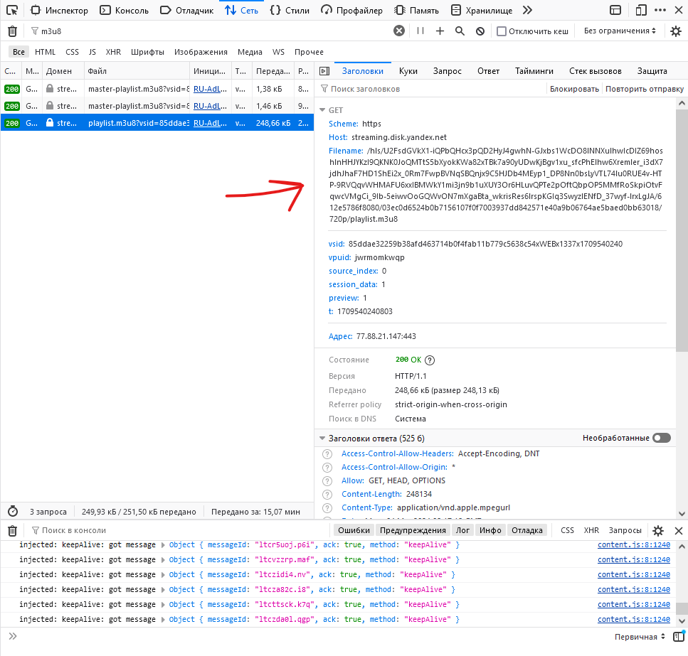

# Загрузчик видео из Яндекс.Диска

Прямое скачивание для тех файлов, которые закрыты для скачивания, недоступно,
но есть возможность загрузить видео по частям, используя плейлисты в формате m3u8.

## Как пользоваться

Рекомендуемая версия Python 3.8.

### Установка пакетов

```sh
python -m venv venv

# Windows
venv/Scripts/activate.bat
pip install -r requirements.txt

# Linux/ Mac
source venv/bin/activate
pip3 install -r requirements.txt
```

### Подготовка данных

Создать файл "playlists.json" со ссылками на плейлисты интересующих видео
в следующем формате:
```json
[
  {
    "name": "название видео",
    "url": "путь к плейлисту"
  },
  ...
]
```

Название видео указывается без расширения, кусочки отдаются в формате **.ts**.

Для получения ссылки на плейлист нужно в браузере перейти в плеер яндекса,
открыть инструменты разработчика (F12 для Firefox) и переключиться
во вкладку "Сеть", далее отфильтровать те запросы, которые относятся
к m3u8 плейлистам, и выбрать с нужным качеством (см. цифры в конце ссылки).

Если плейлиста с нужным качеством нет, то нужно переключить качество видео
в плеере.



Создаём папку "videos" и скачиваем все видео:
```sh
python load_videos.py
```

Теперь нужно собрать кусочки в цельные видео файлы:
```sh
python join_video_parts.py
```
